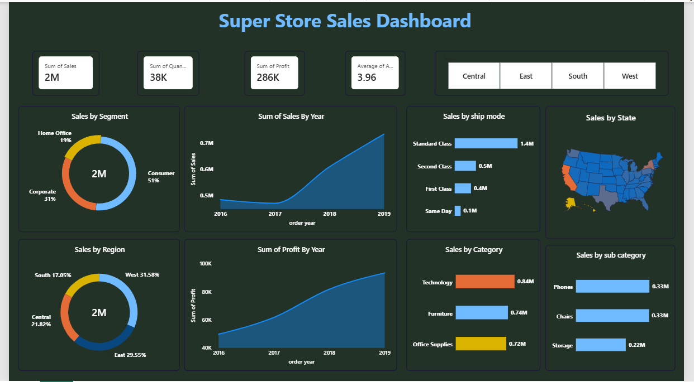

# Super Store Sales Dashboard – Power BI

## 📊 Project Overview

An interactive Super Store Sales Dashboard developed using Microsoft Power BI to analyze sales performance and business trends.

The dashboard provides insights into sales, profit, quantity, customer segments, regions, product categories, shipping modes, and state-wise sales.

## 🛠️ Tools & Technologies

- Microsoft Power BI
- Power Query
- DAX
- Data Visualization
- Business Intelligence

## 📌 Dashboard KPIs

- Total Sales
- Total Quantity
- Total Profit
- Average Value

## 📈 Dashboard Analysis

- Sales by Segment
- Sales by Year
- Sales by Region
- Sales by Category
- Sales by Sub-Category
- Sales by Ship Mode
- Sales by State

## 🎯 Interactive Features

- Region-wise filtering
- Interactive dashboard visuals
- State-wise sales analysis

## 🔍 Key Insights

- Consumer segment represents the largest share of sales.
- Technology is the highest-selling category among the displayed categories.
- Standard Class is the most-used shipping mode.

## 🖼️ Dashboard Preview

## 🎥 Dashboard Demo

[View Dashboard Demo](Super_Store_Sales_Demo.mp4)

## 📁 Project Files

- `Superstore.csv` — Dataset used for the dashboard
- `Super_Store_Sales_Dashboard.pbix` — Power BI dashboard
- `Super_Store_Sales_Dashboard.png` — Dashboard preview
- `Super_Store_Sales_Demo.mp4` — Interactive dashboard demo
